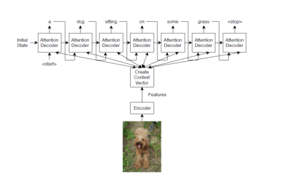
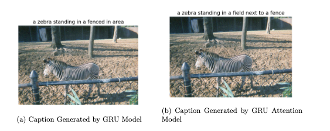

## Abstract

In this project, I propose an approach to image captioning that uses a combi-
nation of a convolutional neural network (CNN) and a recurrent neural network
(GRU). The CNN is used to extract features from the image, while the GRU
is used to generate the caption. The model is trained on the MS-COCO 2017
dataset, which contains over 183k images and captions. I present three different
implementations of the model. The first implementation is a baseline model that
learns its own embeddings for the vocabulary along with a basic RNN. The sec-
ond implementation uses the pre-trained GloVe word vectors, which are a set of
word embeddings that have been trained on a large corpus of text. The third
implementation uses the GloVe word vectors as well as using Gated Recurrent
Units to solve the vanishing gradient problem in the network. The results show
that the third implementation, which uses the GloVe word vectors and Gated
Recurrent Units, achieves the best performance. This suggests that using pre-
trained word vectors and Gated Recurrent Units can improve the performance of
image captioning models. The model is evaluated using the perplexity and BLEU
score metrics. The perplexity metric measures the average number of words in a
sentence that are incorrect, while the BLEU score metric measures the similarity
between a generated sentence and a reference sentence. The results of this paper
suggest that the proposed approach to image captioning is a promising approach
that can be used to generate high-quality image captions

## Model Architecture

## Results

### Installed packages (all just pip install on linux):
numpy
tensorflow
Cython (for the COCO PythonAPI)
matplotlib
scikit-image

Clone the Inception models repo:

### How to extract features from the second-to-last layer of the pretrained CNN:

Dataset: Microsoft COCO:
http://mscoco.org/dataset/#download

For evaluation of captions:

Clone coco-caption and place in the coco folder in the project directory:
https://github.com/Chandramani05/Image-Captioning-Project/tree/main/coco

Make sure java is installed:
$ sudo apt-get install default-jdk

For initialization of the embedding matrix with GloVe vectors:

Download glove.6B.zip from https://nlp.stanford.edu/projects/glove/ and place glove.6B.300d.txt in coco/annotations.

## Documentation

1. GRU_attention_model.py:

ASSUMES: that preprocess_captions.py, extract_img_features_attention.py and create_initial_embeddings.py has already been run.
DOES: defines the GRU_attention model and contains a script for training the model (basically identical to LSTM_attention_model.py).

2. GRU_model.py:

ASSUMES: that preprocess_captions.py, extract_img_features.py and create_initial_embeddings.py has already been run.
DOES: defines the GRU model and contains a script for training the model (basically identical to LSTM_model.py).

3. create_initial_embeddings.py:

ASSUMES: that "preprocess_captions.py" already has been run.
DOES: creates a word embedding matrix (embeddings_matrix) using GloVe vectors.

4. extract_img_features.py:

ASSUMES: that the image dataset has been manually split such that all train images are stored in "coco/images/train/", all test images are stored in "coco/images/test/" and all val images are stored in "coco/images/val". That the Inception-V3 model has been downloaded and placed in inception.
DOES: extracts a 2048 dimensional feature vector for each train/val/test img and creates dicts mapping from img id to feature vector ( train/val/test_img_id_2_feature_vector).

5. extract_img_features_attention.py:

ASSUMES: that the image dataset has been manually split such that all train images are stored in "coco/images/train/", all test images are stored in "coco/images/test/" and all val images are stored in "coco/images/val". That the Inception-V3 model has been downloaded and placed in inception. That the dict numpy_params (containing W_img and b_img taken from the img_transform step in a well-performing non-attention model) is placed in coco/data/img_features_attention/transform_params.
DOES: extracts a 64x300 feature array (64 300 dimensional feature vectors, one each for 8x8 different img regions) for each train/val/test img and saves each individual feature array to disk (to coco/data/img_features_attention). Is used in the attention models.

6. preprocess_captions.py:

ASSUMES: that "split_img_ids.py" already has been run. That the COCO Python API has been installed. That the files captions_train2014.json, captions_val2014.json and glove.6B.300d.txt is placed in coco/annotations. That the folder coco/data exists.
DOES: all necessary pre-processing of the captions. Creates a number of files, see all "cPickle.dump" below.

7. split_img_ids.py:

ASSUMES: that the image dataset has been manually split such that all test images are stored in "coco/images/test/" and all val images are stored in "coco/images/val".
DOES: creates two files (val_img_ids, test_img_ids) containing the img ids for all val and test imgs, respectively. Is later used to sort an img as either train, val or test.

8. utilities.py:

DOES: contains a number of functions used in different parts of the project.
